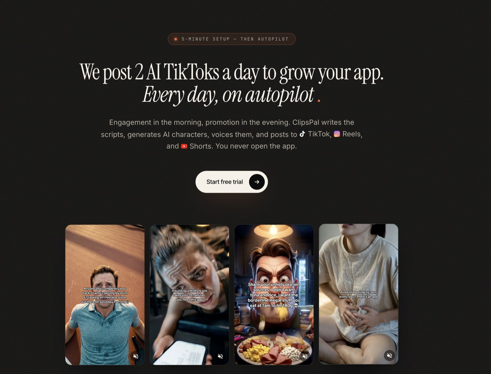

# ClipsPal Hooks — a Claude Code skill



Drop in your b-roll, describe what you do, get **30 TikTok-ready videos**
with AI hook clips + burned-in captions — a month of daily posts from a
single ~$2.70 run. No signup, no watermark, runs locally in Claude Code.

## How it works

1. You describe your project and point at a folder of your existing b-roll.
2. The skill generates a 5-row character matrix (different demographics,
   settings, reactions) tailored to your audience.
3. Each row is rendered as a centered, photorealistic UGC character
   (a still image) via `fal-ai/gemini-3.1-flash-image-preview`
   (Nano Banana 2 / Gemini 3.1 Flash Image — the same model the prod
   ClipsPal pipeline uses).
4. Each character is animated into a 3-second reaction clip via
   `fal-ai/vidu/q3/image-to-video`. **5 clips total** — that's the
   expensive part, and we only spend on it once per run.
5. **30 hook lines** are picked from a curated 820-template app-promo
   library and tailored to your product.
6. Local `ffmpeg` pairs each of the 5 character clips with 6 different
   hook lines + round-robin b-roll, then burns in the captions (TikTok
   Sans Bold + Apple color emoji).

Output: 30 ready-to-post 1080×1920 mp4s in
`<broll_folder>/clipspal-hooks-output/output/` — co-located with the
b-roll so you can find them, not buried in some unrelated cwd.

## Cost per run

You bring your own [fal.ai API key](https://fal.ai/dashboard/keys). One
run costs your fal account roughly:

- 5 Gemini 3.1 Flash Image character stills at 1K: ~$0.40
- 5 Vidu 3-second clips at 720p: ~$2.30
- **Total: ~$2.70 → 30 final videos → ~$0.09 per finished TikTok.**

That's a month of daily TikToks for less than the price of a coffee. The
trick: each of the 5 character clips gets reused under 6 different hook
captions, so the expensive Vidu generations earn their keep 6× over.

Drop the Vidu resolution to 540p (still ~9:16 vertical, slightly
softer) for ~$1.45 total (~$0.05 per TikTok).

## Install

**Run these two commands in Claude Code one at a time — wait for the first
to succeed before pasting the second. Pasting both at once will mash them
into a malformed URL.**

Step 1 — register the marketplace:

```
/plugin marketplace add Kronop/clipspal-hooks-skill
```

Wait for `Successfully added marketplace: clipspal-marketplace`, then —

Step 2 — install the plugin:

```
/plugin install clipspal-hooks@clipspal-marketplace
```

Then run `/reload-plugins` (or restart Claude Code) so the skill is
picked up in the current session.

Or clone the skill directly (no plugin manager):

```bash
git clone https://github.com/Kronop/clipspal-hooks-skill /tmp/clipspal-hooks-skill
cp -R /tmp/clipspal-hooks-skill/skills/generate ~/.claude/skills/generate
```

Then make sure you have the dependencies:

```bash
# macOS
brew install ffmpeg
python3 -m pip install --user Pillow

# Linux
sudo apt install ffmpeg python3-pil
```

(The skill checks these for you at step 0 and prints fix commands if
anything is missing.)

## Use

Open Claude Code in any folder that contains your b-roll, then say:

```
make tiktok hooks for my protein tracker app
```

…or any natural-language equivalent. Claude will load the skill on its own
from the description. (Plugin install also exposes the namespaced command
`/clipspal-hooks:generate` if you prefer to invoke it explicitly.)

The skill will:

1. Verify your prerequisites.
2. Ask for your fal.ai API key (once — persists to `~/.clipspal/fal_key`).
3. Ask for the absolute path to your b-roll folder. Outputs default to
   `<broll_folder>/clipspal-hooks-output/` so they land next to your
   source clips — you can override if you want them elsewhere.
4. Generate a 5-character matrix and **wait for your approval**.
5. Render 5 characters (still images) and **wait for your approval
   again** before spending the bigger fal credits on Vidu.
6. Render 5 reaction clips, pick 30 hook lines, then assemble 30 final
   videos by pairing each clip with 6 different hooks + b-roll
   round-robin. Open the output folder.

If you Ctrl-C mid-run, just re-run the same command from the same folder —
the skill picks up exactly where it left off.

## Tune the look

- Want a different hook text style? Edit
  `skills/generate/scripts/render_overlay.py` (font size, color,
  stroke, position) — same parameters as the prod Lambda renderer.
- Want different reaction archetypes? Edit
  `skills/generate/prompts/matrix.md`.
- Want different hook templates? Edit
  `skills/generate/reference/hook-library.json` (curated copy of
  the prod hook library).

## What's inside

```
clipspal-hooks-skill/
├── .claude-plugin/
│   ├── plugin.json          # Plugin manifest (for /plugin install).
│   └── marketplace.json     # Marketplace entry (for /plugin marketplace add).
└── skills/generate/
    ├── SKILL.md             # The runbook Claude Code follows.
    ├── prompts/             # Prose prompts: matrix + hook selection.
    ├── scripts/
    │   ├── state.py         # state.json + flock — dedupe engine.
    │   ├── fal_submit.py    # Submit one fal job per slot, atomic.
    │   ├── fal_poll.py      # Poll + download artifact, idempotent.
    │   ├── render_overlay.py# TikTok Sans + Apple color emoji PNG renderer.
    │   ├── assemble.sh      # ffmpeg concat + overlay.
    │   ├── check_prereqs.sh
    │   ├── check_broll.sh
    │   └── fal_key.sh
    ├── fonts/               # TikTok Sans Bold + Noto fallbacks.
    └── reference/
        ├── fal-endpoints.md
        ├── hook-library.json# The prod hook library.
        └── permissions-suggested.json
```

## License

Code: MIT. See `LICENSE`.

Fonts are bundled under their respective licenses (Noto under SIL Open
Font License). Apple emoji PNGs are fetched at runtime from
[emoji-datasource-apple](https://www.npmjs.com/package/emoji-datasource-apple)
and cached locally — they are not redistributed in this repo.

---

ClipsPal posts 2 AI TikToks to grow your app, every day — start free at
[clipspal.com](https://clipspal.com).
